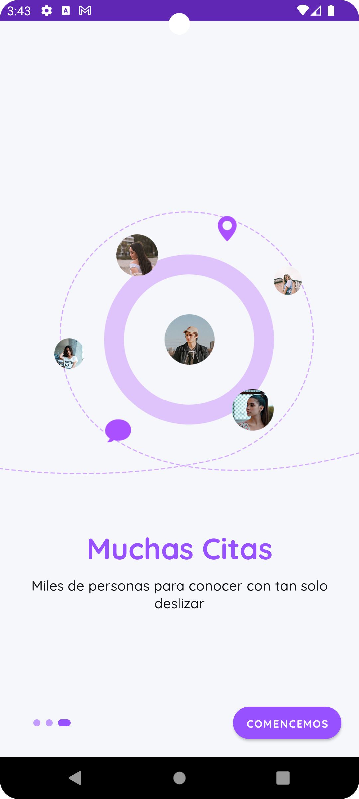

# Fiu Fiu

Proyecto de Aplicación de Citas

## Integrantes:
* Anton Martin
* Condezo Kevin
* Magallanes Jeff
* Mejia Carlos
* Tarrillo Gibran

## Descripción del Proyecto
Fiu Fiu es una aplicación de citas diseñada para conectar personas de manera fácil y divertida. La aplicación permite a los usuarios crear perfiles, buscar coincidencias, y chatear con otros usuarios.

## Características
- Registro y autenticación de usuarios
- Creación y edición de perfiles
- Búsqueda de coincidencias basada en preferencias
- Chat en tiempo real
- Integración con Firebase para almacenamiento y autenticación

## Tecnologías Utilizadas
- **Lenguaje:** Java
- **Framework:** Android
- **Base de Datos:** Firebase

## Capturas de Pantalla
A continuación se muestran algunas capturas de pantalla de la aplicación:





## Instalación
Para instalar y ejecutar la aplicación localmente, sigue estos pasos:

1. Clona el repositorio:
    ```sh
    git clone https://github.com/kevin-condezo/dating-app
    ```
2. Abre el proyecto en Android Studio.
3. Sincroniza las dependencias de Gradle.
4. Ejecuta la aplicación en un emulador o dispositivo físico.

## Contribuciones
Las contribuciones son bienvenidas. Por favor, sigue los siguientes pasos para contribuir:

1. Haz un fork del proyecto.
2. Crea una nueva rama (`git checkout -b feature/nueva-caracteristica`).
3. Realiza los cambios necesarios y haz commit (`git commit -m 'Añadir nueva característica'`).
4. Sube los cambios a tu repositorio (`git push origin feature/nueva-caracteristica`).
5. Abre un Pull Request.

## Licencia
Este proyecto está licenciado bajo la Licencia MIT. Consulta el archivo `LICENSE` para más detalles.